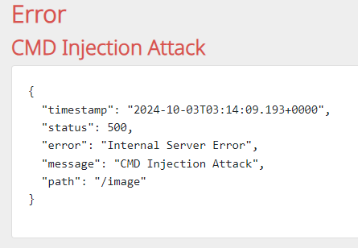
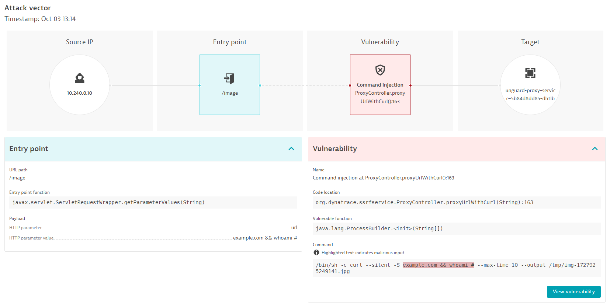

# Command Injection

Unguard has a command injection vulnerability in the image posting feature of the `proxy-service`.

Let's attempt that now.

## Exploitation

Posting the following will result in executing `whoami` after `example.com` has been fetched.

To exploit the command injection vulnerability in the `proxy-service`:

* Log in to Unguard
* Post an image with an URL that adds a second command to the `curl` call.

```
example.com && whoami #
```


!!! info "Remove original curl arguments"
    Notice the trailing `#` will comment out all the other original curl arguments, which is essential.


## Result: SQL Injection Blocked

!!! success
    Dynatrace OneAgent has successfully blocked the SQL injection attack!

To verify that it really has been blocked:

* Click `Home`
* Go back to your profile
* You should still see the empty box and `Add bio` text



## Validate in Dynatrace

Let's see how Dynatrace visualises these attack attempts.

In Dynatrace:

* Press `ctrl + k`. Search for `attacks`

!!! tip "Enlarge Images"
    Remember, right click and "open in a new tab"
    to enlarge images

You should see `1/1 Attacks blocked` and `0/1 Attacks exploited`.


## View Attack Attempt Details

Scroll down to the section titled `1 attack detected` and follow the link to see the details of this attack.

Dynatrace provides all the relevant information such as:

* A unique ID for this attack attempt so tracking is easier
* The entrypoint (a user bio page)
* The SQL statement (actual injection attempt)
* The vulnerable line of code and function





!!! success "Command Injection Prevented"
    🎉 Dynatrace OneAgent has prevented a Command injection attack on your infrastructure.

!!! question "What's Next?"
    Feel free to follow some of the other exploit tutorials or if you're finished, head to the [cleanup page](../cleanup.md) to cleanup your demo environment.

